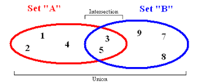

[Home](README.md)
# Set
## Introduction
Sets are data structure where order does not matter and every value is unique. These components are neccessary in a set and are what you leverage in your code. Sets also generally of a O(1) efficiency for its operations. The first important thing to understand about sets is a sets relationship to hashing.
## Hashing
Hashing, in a set, is a way to take any type of data and convert it into an index number that will be the same every time during a runtime. This is how a set works, where when inserting into a set, the set will hash the data that you pass in, and decide where to put the data inside of your set. For example if you want to add to your set the number 2, The set could hash the 2 in a way that it can find that its index value in the set will be 19. Now every time that you want to check to see if there are any 2's in the set, the set would need to only hash a 2 once, and see if that index number 19 has a 2, rather than loop through the whole set.

This is the advantage of using a data structure that uses hashes to insert values. To see if a value is in the set is very easy and quick to do, regardless of the size of the set. Using hashes for operations gives that operation O(1) efficiency. While it is just one hash operation, hashing data will take slightly more time than other traditional operations like `.append()`.
## Order
"Everything has a place, and everything is in it's place" is a good way to understand the order inside of a set. Due to using a hash, and the fact that during different runtimes data can hash differently, sets are unordered. While a 2 will always go to the same index value 19 for this runtime, the next time you run your program, it may hash to index value 0. While your data can be ordered differently at different times, it will always hash somewhere.
## Operations
Sets can be implemented in multiple languages. Below are common names for the operations and python specific examples on how to implement them
* add(value) - uses hashing to add the value to the set
```python
my_set = set()
my_set.add(1)

print(my_set)
# {1}
```
* remove(value) - hashes the value, and then removes that value at the specified index
```python
my_set = set()
my_set.add(1)
my_set.remove(1)

print(my_set)
# set()
```
* member(value) - hashes the value and sees if there is something there at the designated spot
```python
my_set = {2,1,4,3}

if 3 in my_set:
    my_set.remove(3)

print(my_set)
# {2,1,4}
```
* size() - returns the number of items in the set
``` python
my_set = set()
my_set.add(2)
length = len(my_set)
print(length)
# 1
```
## Efficiency in terms of O Notation

Operation | Performance 
-------- | -------- 
add(value) | O(1) 
remove(value) | O(1) 
member(value) | O(1)
size() | O(1)

As you can see, using a set is a very good way to hold data in terms of performance. If you are holding onto data, where you want unique values, and you do not need a specific order, try using a set.

## Intersection and Union
There are built-in-functions that python has that allows you to take multiple sets and combine them either at the intersection, or as a whole. 



Here is how you implement that in code with both the `intersection()` and `union()` functions, with alternate operators as well.

```python
my_set = {1, 2, 3, 4, 5}
your_set = {4, 5, 6, 7, 8}

our_set = intersection(set1, set2)  
our_set = set1 & set2
print(our_set)
# {4,5}

our_combined_set = union(set1, set2)  
our_combined_set = set1 | set2 
print(our_set)
# {1,2,3,4,5,6,7,8}
```

## Example

In this example we are trying to count the number of duplicates in our list using O(n) performance. Normally, if you were to try to do this with a list, you would have O(n^2) performance because you would loop through the first list, and have it check against the things in the list until it finds a duplicate. Using a set can help to find duplicates. You can also see the fast look-up speed at the end of the example

```python
#Create a random list of 45 numbers between 0 and 30
randomlist = []
for i in range(0,45):
    n = random.randint(0,30)
    randomlist.append(n)
print('\nOur random list:')
print(randomlist)

# Create a set of that list (O(n))
unique_values = set(randomlist)

number_of_duplicates = len(randomlist) - len(unique_values)

print(f'\nThe number of duplicates in the list = {number_of_duplicates}')
print('Unique values - {}'.format(unique_values))
find_number = int(input("\nEnter a number to see if it is in the set: \n"))

# O(1)
if find_number in unique_values:
    print('That number is in the set!')
else:
    print('Sorry, that number is not in the set')
```
## [Problem to Solve](set-problem.py)
In the problem below, implement a set to be able to find which values are common in three lists. Do this without using the `intersection()` or & python functions. This implementation should be O(n) performance.

```python
"""
Build your own function to find common values of three lists using a set
"""

def intersect_lists(list_1, list_2, list_3):
    new_list = []

    # Solve problem here


    return new_list

list_1 = [2,3,5,6,8,9,10,12,13,21]
list_2 = [8,7,11,19,20,5,1,0,21,6,10]
list_3 = [5,,11,17,10,20,8,21,14,4,13]

new_list = intersect_lists(list_1,list_2,list_3)
print(new_list) #Expected: [5, 6, 8, 21, 10]
```
## [Solution](set-problem-solved.py)
Here is an example of how you could solve this above problem.

Try to write your own code before you look at this solution. You can do it!

```python
def intersect_lists(list_1, list_2, list_3):
    new_list = []

    # You can see that this function only goes through all of the data once, then does several O(1) operations

    set_2 = set(list_2)
    set_3 = set(list_3)

    for item in list_1:
        if item in set_2:
            if item in set_3:
                new_list.append(item)

    return new_list
```
[Home](README.md)