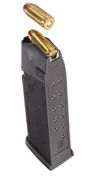

[Home](README.md)
# Stack
## Introduction
A stack is a data structure where order is the most important thing. Everything in a stack operates in a FILO structure, meaning First In, Last Out. For example when loading bullets into a cartridge you load the first bullet in, and as you push the other bullets in, it pushes that first bullet further into the cartridge. The last bullet that you shoot before you are empty is the first bullet you loaded. In this way a stack is great at reversing data.

## Reverse data
One of the greatest strengths of the stack is its ability to reverse ordered data easily. All you need to do is add all of the data to the stack, and then remove it all. Since all of the operations of a stack operate with the last position only, it is O(n) efficiency to reverse a whole data set.
## Operations
Stacks can implemented in all languages. In Python an easy way to create a stack is using a simple list, where you only interact with the last position as follows:
* append(value) - Adds to the end of the stack
```python
my_stack = []
my_stack.append(1)

print(my_stack)
# [1]
```
* pop(value) - removes the value at the end and returns it so that you can use it
```python
my_stack = [1,2,3,4,5]
my_stack.pop() # removes 5

last = my_stack.pop()

print(last)
# 4
```
* size() - returns the number of items in the stack
``` python
my_stack = [1,2,3,4,5]

length = len(my_stack)
print(length)
# 5
```
* empty() - Checks to see if your stack is empty.
```python
my_stack = []
if len(my_stack) == 0:
    print("It's Empty")
else:
    print("It's not Empty")

# It's Empty

```
## O Notation of a Stack
A stack is really good to use because all of it's operations are O(1)
Operation | Performance 
-------- | -------- 
append(value) | O(1) 
pop(value) | O(1) 
size(value) | O(1)
empty() | O(1)
## Example
In this example I will show how in O(n performance you can reverse all of the data in a stack). I will be doing this with the [IMDB top 10 movies list](https://www.imdb.com/chart/top/). We are starting with the stack in order of 10th best to first.
```python
ten_to_one = [
    'The Good, the Bad and the Ugly',
    'The Lord of the Rings: The Fellowship of the Ring',
    'Pulp Fiction',
    'The Lord of the Rings: The Return of the King',
    "Schindler's List",
    '12 Angry Men',
    'The Godfather: Part II',
    'The Dark Knight',
    'The Godfather',
    'The Shawshank Redemption'
]
one_to_ten = []

# Now reverse the order O(n)  
for _ in range(len(ten_to_one)):
    one_to_ten.append(ten_to_one.pop())

print(one_to_ten)
# ['The Shawshank Redemption', 'The Godfather', 'The Dark Knight', 'The Godfather: Part II', '12 Angry Men', "Schindler's List", 'The Lord of the Rings: The Return of the King', 'Pulp Fiction', 'The Lord of the Rings: The Fellowship of the Ring', 'The Good, the Bad and the Ugly']
```
## Problem to Solve
Now try to solve the following problem using a stack.
Imagine you are a game developer trying to program shooting a gun in the game. Each time you reload the gun, it will fill up with the next ammunition type in the cycle: Regular, Piercing, Hollow-tip. Your job is to implement Stack functions to solve this problem. Use the code below to solve and test this problem.
```python
class Gun:
    def __init__(self):
        self.reload_cycle = ['Regular', 'Piercing', 'Hollow-tip']
        self.current_reload_index = 3 
        self.cartridge = []
        self.cartridge_max = 5

    def Shoot(self):
        """
        A function that checks to see if the gun is empty, and then returns the bullet it its not empty, otherwise return "empty"
        """
        # Your code here


    def Reload(self):
        """
        Have the cartridge reload to max capacity using the next bullet type in the cycle
        """
        self.current_reload_index +=1
        
        if self.current_reload_index >= len(self.reload_cycle):
            self.current_reload_index = 0
        
         # Your code here

    
    def Show_Next_Bullet(self):
        """
        print what the next bullet in the cartridge to be shot is
        """
        
        # Your code here

gun = Gun()
gun.Reload()
print(gun.Shoot()) #'regular'
gun.Shoot()
gun.Shoot()
gun.Reload()
gun.Show_Next_Bullet() # 'piercing'
gun.Shoot()
gun.Reload()

print("\nShoot the rest")
print(gun.Shoot()) #'hollow-tip'
print(gun.Shoot()) #'piercing'
print(gun.Shoot()) #'piercing'
print(gun.Shoot()) #'regular'
print(gun.Shoot()) #'regular'
print(gun.Shoot()) #'empty'
```

## Solution
Try solving the above problem before comparing your code to this possible solution.
```python
class Gun:
    def __init__(self):
        self.reload_cycle = ['Regular', 'Piercing', 'Hollow-tip']
        self.current_reload_index = 3 
        self.cartridge = []
        self.cartridge_max = 5

    def Shoot(self):
        """
        A function that checks to see if the gun is empty, and then returns the bullet it its not empty, otherwise return "empty"
        """
        if(len(self.cartridge) != 0):
            return self.cartridge.pop()
        else:
            return 'Empty'

    def Reload(self):
        """
        Have the cartridge reload to max capacity using the next bullet type in the cycle
        """
        self.current_reload_index +=1
        
        if self.current_reload_index >= len(self.reload_cycle):
            self.current_reload_index = 0
        
        while len(self.cartridge) < self.cartridge_max:
            self.cartridge.append(self.reload_cycle[self.current_reload_index])
    
    def Show_Next_Bullet(self):
        """
        print what the next bullet in the cartridge to be shot is
        """
        copy = self.cartridge[:]
        print(copy.pop())

gun = Gun()
gun.Reload()
print(gun.Shoot()) #'regular'
gun.Shoot()
gun.Shoot()
gun.Reload()
gun.Show_Next_Bullet() # 'piercing'
gun.Shoot()
gun.Reload()

print("\nShoot the rest")
print(gun.Shoot()) #'hollow-tip'
print(gun.Shoot()) #'piercing'
print(gun.Shoot()) #'piercing'
print(gun.Shoot()) #'regular'
print(gun.Shoot()) #'regular'
print(gun.Shoot()) #'empty'
```
[Home](README.md)