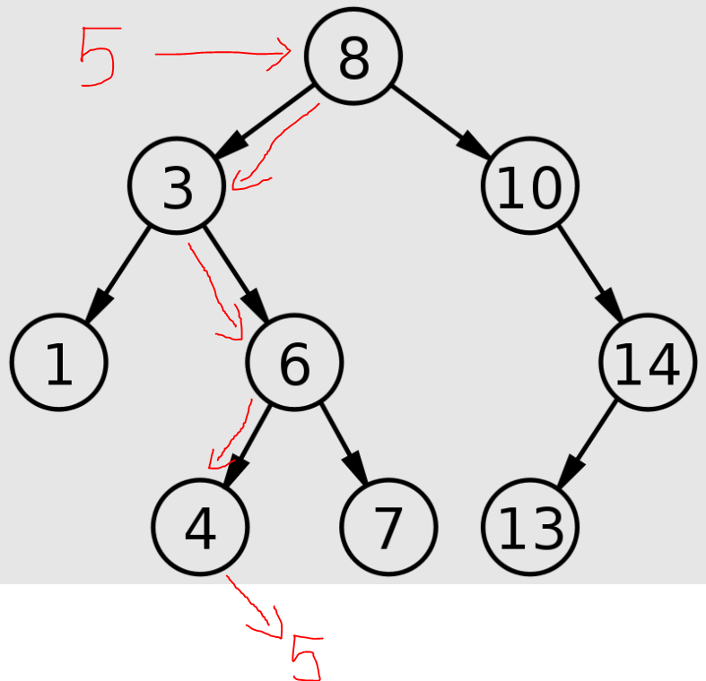

[Home](README.md)
# Tree
## Introduction
A tree is a data structure where data is stored in nodes, where they are ordered in such a way that where following the tree in one direction is a higher value, and in the other direction is a lower value. The top node of a tree is called the root and nodes that connect to other nodes are leaf nodes. Each node generally only holds the data value, the nodes it is connected to (parent nodes), and nodes connected to it (child nodes). A strength of Trees, or Binary Search Trees (BST), is that each time you do an operation you are cutting out half of the remaining possibilities, making it easier to find something.


When adding a number to a tree you start at the root node. If the new value is greater than the root data, it goes on the right. If it is less than the root data, it goes on the left. Then you repeat this with each child node following the appropriate path, until you find an open spot on the tree where there is no child on the side it needs to go on. 

For example, to add  a 5 to the tree above we would see that 5 is less than 8, thus going down the left side. then we can see that 5 is greater than 3, so it should go on the right side. We would follow to the six on the tree and see that it 5 is less than that, so we would go to the 4. Seeing that 5 is greater than 4, and seeing that the right side of the tree is empty, we would place the 5 to the right side as a child of the 4. following this path as follows: 8,3,6,4,5



Thinking about this you can see how you could place multiple numbers logically, and given a tree structure, be able to find a single number within a few simple checks.

## Recursion in trees
Due to what was explained above, many operations cut down on half of the data set and run again in a tree. This means that many operations done in a tree should be done using recursion. Recursion is when you call a function during the code of the function. To properly recure will always have to important pieces, the base case and the part that you want to repeat. The base case is very important so that your loop will stop recurring at some point. As you can see with the example above, you need to call the same check over and over until there is an open space where the 5 needs to go. So the base case is when the direction the data needs to go is empty, otherwise call the insert function again comparing the node that is in the spot that the 5 needs to go with the 5. 

It takes a bit of a change of thinking to write recursive functions, but there are benefits to doing this. When inserting into a tree recursively, you cut out half of the remaining tree on each loop, that gives you O(log n) efficiency, which os more efficient than O(n).

## Operations and O notation of a tree
I will explain the following operations below without code examples. there is no built-in-method for a binary search tree in python, so I will explain what each function does so thta you can create one yourself.

* insert(value) - As explained above to insert something into a tree you have to recursively check down the tree to see where a value should go, to the left if its lower, and to the right if its higher.

* remove(value) - in a similar way to the insert function, you use recursion to find the value in a tree, and then remove that node.

* contains(value) - use recursion to go through the tree to find where the number should be, if its there, return true.

* traverse_forward() - replace the __iter__ function of the tree to yield each item from smallest to largest.

* traverse_reverse() - replace the __reversed__ function to yield each item from largest to smallest.

* height(node) - determine how far down from a specified node until there are open spots beneath it on both sides.

* size() - return the number of nodes in the tree.

* empty() - return true if the size is zero.

Operation | Performance 
-------- | -------- 
insert(value) | O(log n) 
remove(value) | O(log n) 
contains(value) | O(log n)
traverse_forward() | O(n)
traverse_traverse() | O(n)
height(node) | O(n)
size() | O(1)
empty() | O(1)

## Balancing a tree

Naturally, depending the order in which you insert values into a tree, it will look vastly different, just like a tree will look different with a different root value. That is why it is important to regularly balance your tree so that the height of all of the nodes on the ends are within one of each other. You do this so that you still can get the efficiency benefits of using a tree to the max.

## Example
Below is an example of how to implement a tree in python, and how to make an insert function.

```python
class BST:
    def __init__(self,data):
        node = self.node(data)
        root = node

    class node:
        def __init__(self,data):
            self.left = None
            self.right = None

            self.data = data

    def insert(self, data):
        self._insert(data, self.root)

    def _insert(self,data,node):
        
        if data < node.data:
            if node.left is None:
                # base case for the left side
                node.left = BST.Node(data)
            else:
                # use recursion to keep checking
                self._insert(data, node.left)

        
        elif data >= node.data:
            if node.right is None:
                # second base case for the right side
                node.right = BST.Node(data)
            else:
                # use recursion to keep checking
                self._insert(data, node.right)
```
## Problem to Solve
Make a  forwawrd_traversal function so that you can test to see the insert function working. do this starting with the base code so you can complete your own tree!

```python
class BST:
    def __init__(self,data):
        node = self.node(data)
        self.root = node

    class node:
        def __init__(self,data):
            self.left = None
            self.right = None

            self.data = data

    def insert(self, data):
        self._insert(data, self.root)

    def _insert(self,data,node):
        
        if data < node.data:
            if node.left is None:
                # base case for the left side
                node.left = self.node(data)
            else:
                # use recursion to keep checking
                self._insert(data, node.left)

        
        elif data >= node.data:
            if node.right is None:
                # second base case for the right side
                node.right = self.node(data)
            else:
                # use recursion to keep checking
                self._insert(data, node.right)

    def __iter__(self):
        yield from self._traverse_forward(self.root)
    
    def _traverse_forward(self, node):
        """
        check if a node is empty, if its not, use recursion to go to the next node and yield its data. remember to use `yield` and `yield from` to properly create a __iter__ function
        """
        # Your code here


bst = BST(7)

bst.insert(9)
bst.insert(8)
bst.insert(12)
bst.insert(4)
bst.insert(6)
bst.insert(1)

for number in bst:
    print(number)

# 1
# 4
# 6
# 7
# 8
# 9
# 12

print('--------------')
# apply a temporary change using numbers from the whole tree
for number in bst:
    number += 1
    print(number)

# 2
# 5
# 7
# 8
# 9
# 10
# 13
```

## [Solution](Stack_Solution.py)
Try solving the above problem before comparing your code to this possible solution.

If you can not figure out how to use recursion correctly, try writing this with a `for` loop, then check your answer to the solution below to be able to see how recursion can be used.

* [Solution](Stack_Solution.py)

[Home](README.md)